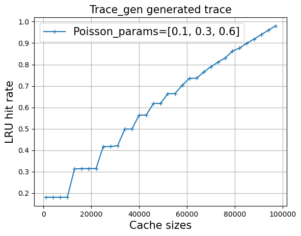

# trace_gen  
**[A prototype library that generates realistic block IO workloads](https://https://github.com/Effygal/zns-obj)**
## Status

Generates traces of 1D integer array that represent read address accesses;

Modules:
    (1) `TraceGenerator`---generate a synthetic trace with a list of Poisson rates that add up to one as input.
    (2) `TraceReconstructor`---generate synthetic traces with a real-world trace as input. Supports inter-reference time-based reconstruction and frequency-based reconstruction.
    (3) `LRU` cache simulator. 
## Installation
Under the main trace-gen directory, install `trace_gen` via pip:
```bash
pip install .
```
Or install the compressed release version:
```bash
pip install pip install trace_gen-0.1.0-cp310-cp310-linux_x86_64.whl
```
## Usage

Under any development directory:

```Python
import trace_gen as tg
```

### TraceGenerator
Use TraceGenerator to generate a trace of length $n$, with accesses in $\{0 \cdots M-1\}$, with three Poisson rate classes $\{0.1, 0.3, 0.6\}$:
```Python
generator = tg.TraceGenerator(M=100000, n=10000000, rw_ratio=0.5, poisson_params=np.array([0.1, 0.3, 0.6]))
trace1 = generator.generate_trace()
```
Simulate LRU cache hit rate:
```Python
c = np.arange(1000, 100000, 3000)
hr_trace1 = [tg.sim_lru(_c, trace1) for _c in c]
```
The result MRC behaves:


### TraceReconstructor
Use `TraceReconstructor` to reconstruct a synthetic trace of given real trace `w26` of length $n$:
```Python
w26 = np.loadtxt(f'/opt/traces/w26_r.txt', dtype=np.int32)
w26_reconstructor = tg.TraceReconstructor(w26)
```
Inter-reference time-based reconstruction:
```Python
w26_irt_reconstructed = w26_reconstructor.generate_irt_trace(n=100000)
```
Frequency-based reconstruction:
```Python
w26_irm_reconstructed = w26_reconstructor.generate_irm_trace(n=100000)
```