# trace_gen  
**[A library that generates realistic block I/O workloads](https://https://github.com/Effygal/trace-gen)**
## Status

Generates traces of 1D integer array that represent address accesses;

Modules:
    (1) `TraceGenerator`---generate synthetic traces from scratch with specified parameters;
    (2) `TraceReconstructor`---generate synthetic traces that are reconstructed based on a given real-world trace; supports inter-reference distance-based reconstruction and frequency-based reconstruction;
    (3) `LRU` cache simulator (novel); 
    (4) `FIFO` cache simulator;
    (5) `CLOCK` cache simulator.
## Installation
Under the main trace-gen directory, install `trace_gen` via pip:
```bash
pip install .
```
Or install the release/distribute version:
```bash
pip install trace_gen-0.1.0-cp310-cp310-linux_x86_64.whl
```
## Usage

Under any development directory:

```Python
import trace_gen as tg
```

### TraceGenerator
Use TraceGenerator to generate a trace of length $n$, with reference addresses in $\{0 \cdots M-1\}$, with $k$ traffic classes, with skewness $s$, and frequency-dependent parameter $p$:
```Python
generator = tg.TraceGenerator(M = 100, n = 10000)
trace1 = generator.generate_trace(k = 5, s = 1, p = 0.5)
```
Simulate LRU & FIFO & CLOCK cache hit rate:
```Python
c = np.arange(M//100, M, M//100)
hr_trace1_lru = [tg.sim_lru(_c, trace1) for _c in c]
hr_trace1_fifo = [tg.sim_fifo(_c, trace1) for _c in c]
hr_trace1_clock = [tg.sim_clock(_c, trace1) for _c in c]
```


#### MRCs under various settings

##### Vary the freqency parameter $p$:
- When $p=0.5$, the trace is 50% freq-based and 50% ird-based, MRC convex/concave behavior shows evenly combined:

```Python
trace1 = generator.generate_trace(k = 5, s = 1, p = 0.5)
```

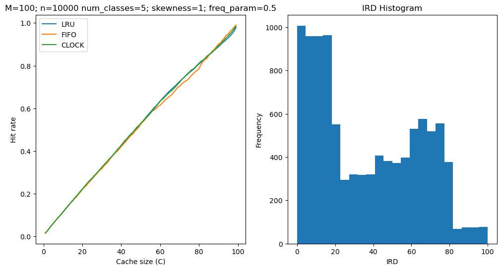

- When $p = 1$, the trace is 100% freqency-based, MRC behaves convex.

```Python
trace2 = generator.generate_trace(k = 5, s = 1, p = 1)
```
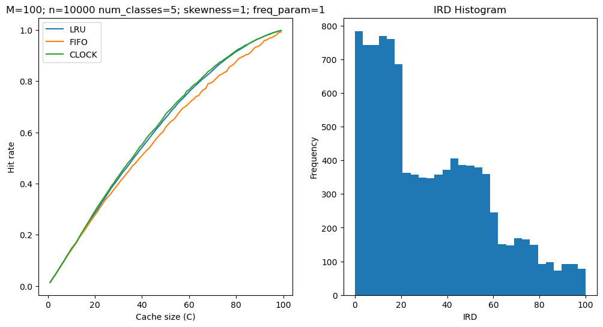

- When $p=0$, the trace is 100% ird-based, MRC behaves (somewhat) concave:

```Python
trace3 = generator.generate_trace(k = 5, s = 1, p = 0)
```

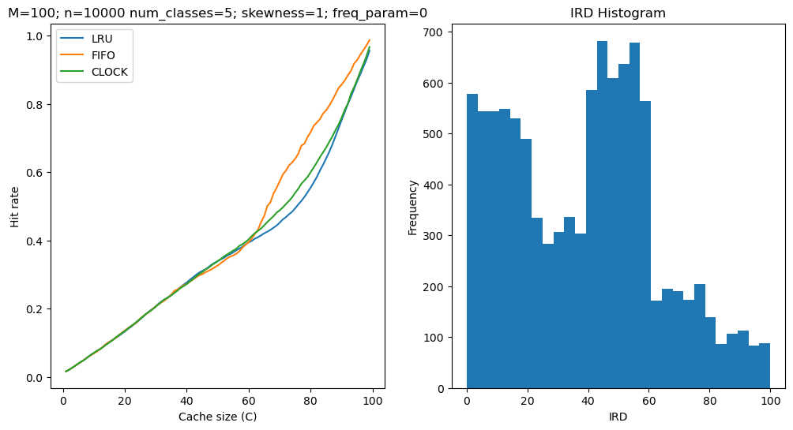

- When $p=0.2$, the trace is 20% frequency-based and 80% ird-based, MRC behaves somewhat mixed:

```Python
trace4 = generator.generate_trace(k = 5, s = 1, p = 0.2)
```
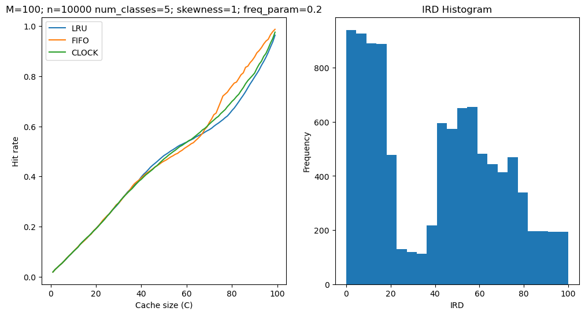

##### Vary the skewness $s$:

- When $s=0$, the weight of each traffic class is uniform:
```Python
trace5 = generator.generate_trace(k = 5, s = 0, p = 0)
```
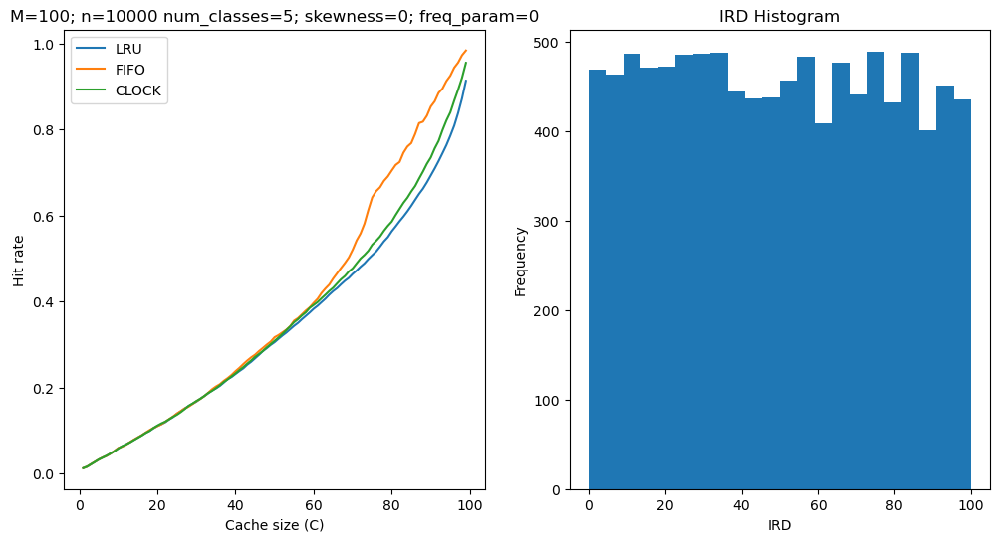

- When $s=9$, the weight of each traffic class is highly skewed, the MRCs behaviors are more pronounced at any $p$:
```Python
trace6 = generator.generate_trace(k = 5, s = 9, p = 0)
```
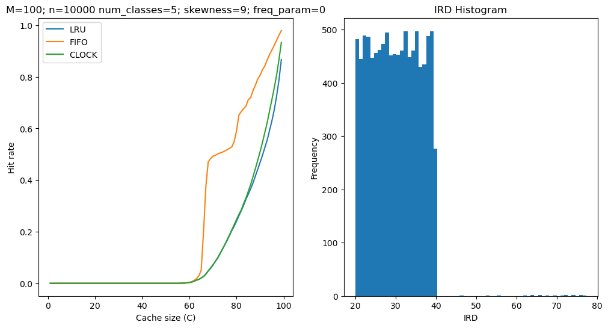

```Python
trace7 = generator.generate_trace(k = 5, s = 9, p = 0.8)
```
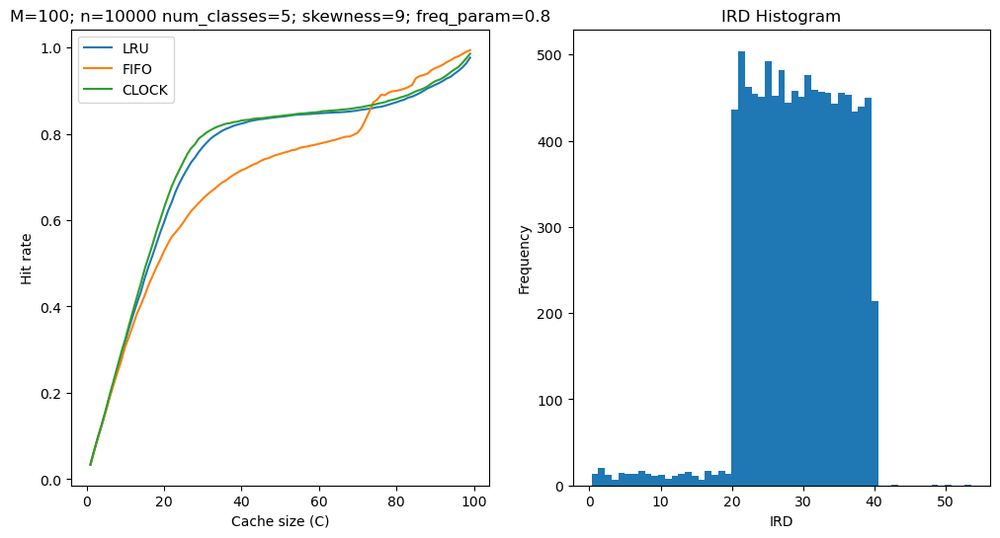

```Python
trace8 = generator.generate_trace(k = 5, s = 9, p = 0.3)
```
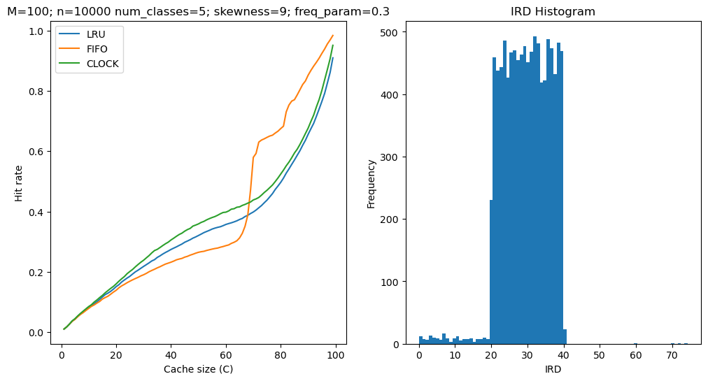

```Python
trace9 = generator.generate_trace(k = 5, s = 9, p = 1)
```
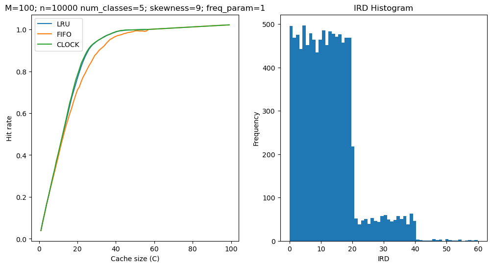

##### Vary the number of classes $k$:

- When the number of classes is high, MRCs show higher mixed convex/concave behaviors:
```Python
trace10 = generator.generate_trace(k = 30, s = 9, p = 0)
```
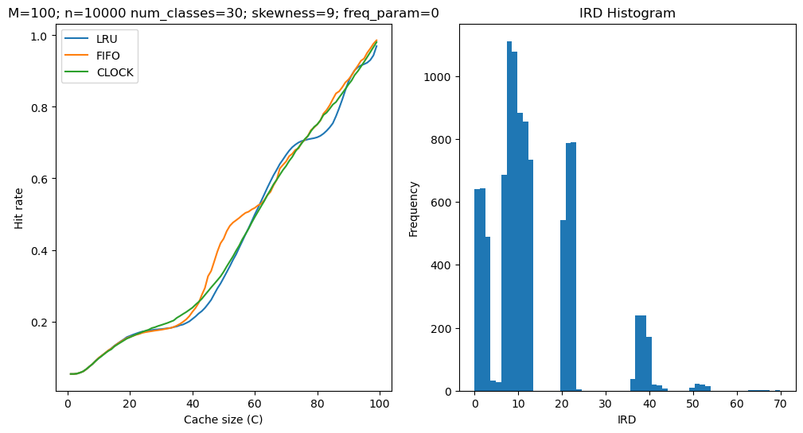
```Python
trace11 = generator.generate_trace(k = 30, s = 9, p = 0.2)
```
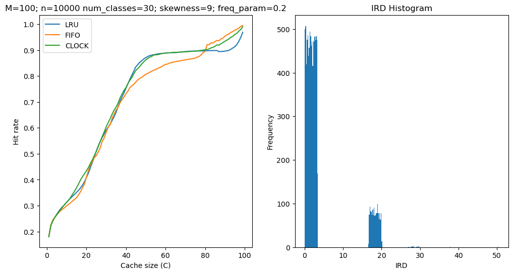
```Python
trace12 = generator.generate_trace(k = 30, s = 9, p = 0.5)
```
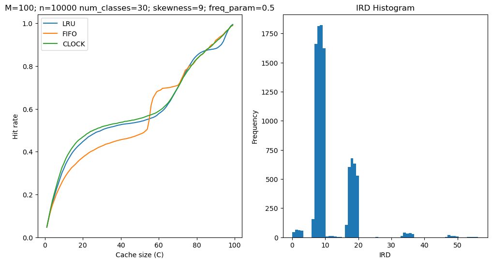


### TraceReconstructor
Use `TraceReconstructor` to reconstruct a synthetic trace of given real trace `w26` of length $n$:
```Python
w26 = np.loadtxt(f'/opt/traces/w26_r.txt', dtype=np.int32)
w26_reconstructor = tg.TraceReconstructor(w26)
```
Inter-reference time-based reconstruction:
```Python
w26_irt_reconstructed = w26_reconstructor.generate_irt_trace(n=100000)
```
Frequency-based reconstruction:
```Python
w26_irm_reconstructed = w26_reconstructor.generate_irm_trace(n=100000)
```
<!-- ### HASH-based sampling
SHARDS item sampling:
- $hash(a)$ mod $P < T$, where $P$ is the modulus (e.g. 100) and $T$ is the threshhold;
- Has a samping rate of $R = T/P$, each sample represents $1/R$ addresses;
- Subset-inclusion;
- each computed stack distance must be scaled by $1/R$;
- SHARDS shows empirical evidencethat $R = 0.001$ (sampled set size $R\cdot M$; sample trace size $R \cdot N$) yields very accurate MRCs;
- Evaluation: use open-source C-implementation of PARDA which takes a trace as input, computes SD offline, yields an MRC; 
- Implementation: 2 data structures:
    - a hash table maps a addr to its most recent refer timestamp;
    - a splay tree to compute num of distinct addrs since this time stamp.
- Minor modify PARDA code:
    - hash each referenced addr, process only when $hash(a) \ mod \ P < T$ is met; $P$ is set to a power of 2 and "mod $P$" is implemented with inexpensive "$\& (P-1)$";
    - For a given sampling rate $R$, set threshhold $T = round(R \cdot P)$;
    - use the public domain C implementation of MurmurHash to achieve hashing;
    - each computed SD is simply divided by $R$ to align with scaled distance $SD/R = (SD \cdot P) / T$.

- PARDA binary trace format: a sequence of 64-bit references, with no additional metadata; need to convert I/O traces to the PARDA format, assume fixed cache block size,  ignore distinction between reads and writes;
- either fixed-sample size ($M$) is suitable for online use in memory-constrained systems such as device deivers in embedded systems; uses automatic rate adaptation to eliminate the need to specify $R$. Starts with $R_0 = 0.1$, and lower progressively as more uunique addrs are encountered;
- or fixed-rate sampling: fix $R$. -->


